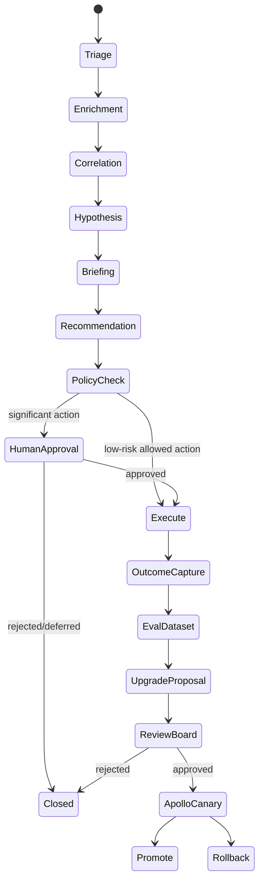
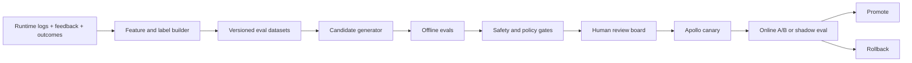

# ClearGlassInc Artemis — Self-Evolving AI Intelligence Platform
## Palantir Gotham + Foundry + AIP + Apollo with Quantum-Centric Optimization

> **Grounding constraint.** This blueprint treats quantum capability as an optimization accelerator, not as an autonomous decision authority. The quantum/HPC layer is grounded in IBM's March 2026 quantum-centric supercomputing reference architecture, IBM's 7,500-gate near-term circuit target, public 2026 practical quantum-advantage framing for real-world optimization workloads, and the already-proven industrial pattern of AI-powered digital twins that use operational data, simulation, and feedback loops for continuous optimization.

---

## System Architecture

### 1. Mission Objective

**ClearGlassInc Artemis** is a secure, coalition-aware, latency-sensitive intelligence platform that fuses live and historical data, reasons over the resulting operational picture, supports human commanders and analysts, and continuously improves its own prompts, workflows, routing heuristics, and optimization policies inside explicit human-approved guardrails.

The platform is organized around four Palantir planes:

| Plane | Palantir product | Artemis responsibility |
|---|---|---|
| Operational intelligence | **Gotham** | Investigations, entity tracking, case management, watchlists, mission timelines, operational decision support. |
| Data and ontology | **Foundry** | Data integration, pipeline lineage, ontology objects/links/actions, semantic access control, application logic. |
| AI orchestration | **AIP** | Copilots, tool-using agents, model routing, evals, prompt/workflow registries, human approval workflows. |
| Secure deployment | **Apollo** | Signed deployments, environment-aware rollout, canaries, rollback, freeze windows, runtime configuration control. |

### 2. End-to-End Topology

```mermaid
flowchart LR
  subgraph UX[Frontend / Operator Experience]
    UI[Next.js Mission Console]
    MAP[Geospatial Ops Map]
    COP[Analyst + Commander Copilots]
    QREC[Quantum Recommendation Panel]
    APPROVE[Approval + Explainability Console]
  end

  subgraph EDGE[Zero-Trust Edge]
    GW[Envoy / API Gateway]
    MTLS[mTLS + OIDC/SAML]
    PEP[Policy Enforcement Point]
    WS[WebSocket / gRPC Streams]
  end

  subgraph SVC[Python Backend Services]
    ING[Ingestion Service]
    FUS[Fusion + Entity Resolution]
    CASE[Case Service]
    WF[Workflow Service]
    AG[Agent Orchestrator]
    OPT[Classical + Quantum Optimizer]
    EVAL[Evaluation Service]
    AUD[Audit + Provenance]
  end

  subgraph STREAM[Streaming Fabric]
    KAFKA[Kafka / Redpanda]
    SCHEMA[Schema Registry]
    DLQ[DLQ + Replay]
    CDC[CDC Connectors]
  end

  subgraph FOUNDRY[Foundry Data + Ontology]
    BRONZE[Bronze Raw Products]
    SILVER[Silver Normalized Products]
    GOLD[Gold Ontology Products]
    ONT[Ontology Objects, Links, Actions]
    LIN[Lineage + Data Health]
  end

  subgraph AIP[AIP AI Runtime]
    ROUTER[Model Router]
    TOOLS[Audited Tool Runtime]
    PROMPTS[Prompt + Workflow Registry]
    EVH[Offline/Online Eval Harness]
  end

  subgraph QCS[Quantum-Centric Supercomputing Layer]
    CPU[CPU Clusters]
    GPU[GPU Solvers]
    QPU[IBM Quantum QPUs]
    SIM[Qiskit Aer / Statevector / Tensor Sim]
    SCHED[Hybrid Scheduler]
  end

  subgraph APOLLO[Apollo Delivery + Runtime Control]
    SIGN[Signed Artifacts]
    CANARY[Ring / Canary Promotion]
    FREEZE[Mission Freeze Windows]
    ROLL[Rollback Controller]
  end

  UX --> EDGE --> SVC
  SVC <--> STREAM
  SVC <--> FOUNDRY
  SVC <--> AIP
  OPT <--> QCS
  AIP --> APOLLO
  SVC --> APOLLO
```



### 3. Design Principles

1. **Human command authority remains explicit.** Agents may recommend, draft, simulate, and prepare action packages; operationally significant actions require approval.
2. **Ontology first.** Humans and agents operate over the same Foundry ontology so object permissions, lineage, confidence, and mission context are shared.
3. **Self-improvement is versioned production change.** Prompt, workflow, router, model, and QUBO-policy changes are proposed, evaluated, reviewed, canaried, and rollback-capable.
4. **Quantum is an accelerator behind an API.** QAOA and other hybrid algorithms are invoked only when evals show value over classical baselines for a bounded optimization class.
5. **Coalition boundaries are data-plane and tool-plane controls.** Redaction, denial, and compartment routing happen before AI context construction and before every tool call.

---

## Data and Ontology

### 1. Foundry Ontology Model

Foundry's ontology becomes the operational contract between Gotham workflows, AIP agents, and backend services.

```yaml
objects:
  Mission:
    key: mission_id
    attributes:
      - name
      - objective
      - theater
      - priority
      - status
      - coalition_tags
      - compartments
      - constraints
      - commander_intent
      - latency_budget_ms

  Entity:
    key: entity_id
    attributes:
      - entity_type        # person, organization, asset, device, facility, vehicle, cyber_indicator
      - canonical_name
      - aliases
      - risk_score
      - confidence_score
      - classification
      - compartments
      - coalition_visibility
      - last_observed_at

  Signal:
    key: signal_id
    attributes:
      - source_system
      - source_reliability
      - ingest_ts
      - event_ts
      - raw_hash
      - payload_uri
      - confidence_score
      - schema_version

  Event:
    key: event_id
    attributes:
      - event_type
      - severity
      - confidence_score
      - location
      - first_seen
      - last_seen
      - state             # new, triaged, enriched, escalated, closed
      - mission_relevance

  Hypothesis:
    key: hypothesis_id
    attributes:
      - statement
      - probability
      - support_score
      - contradiction_score
      - generated_by
      - reviewed_by
      - review_state

  Recommendation:
    key: recommendation_id
    attributes:
      - action_type
      - rationale
      - expected_impact
      - risk_score
      - confidence_score
      - requires_approval
      - approval_state
      - prompt_version
      - workflow_version
      - model_route

  OperatorFeedback:
    key: feedback_id
    attributes:
      - operator_id
      - verdict           # accept, reject, edit, defer
      - edited_fields
      - rationale
      - trust_score
      - timestamp
      - outcome_link

  OptimizationProblem:
    key: optimization_id
    attributes:
      - problem_type      # triage, routing, allocation, HVAC_GLASS_QUBO
      - objective_terms
      - constraints
      - qubo_uri
      - baseline_solver
      - quantum_solver
      - gate_budget
      - status

links:
  - OBSERVED_AS: Signal -> Event
  - INVOLVES: Event -> Entity
  - INDICATES: Event -> Hypothesis
  - SUPPORTS: Signal -> Hypothesis
  - CONTRADICTS: Signal -> Hypothesis
  - SCOPED_TO: Event -> Mission
  - RECOMMENDS_FOR: Recommendation -> Mission
  - JUSTIFIED_BY: Recommendation -> Hypothesis
  - REVIEWED_BY: Recommendation -> OperatorFeedback
  - DERIVED_FROM: Recommendation -> Signal
  - OPTIMIZES: OptimizationProblem -> Mission
```

### 2. Confidence, Lineage, and Time

Every ontology object and link carries a common metadata envelope:

```json
{
  "confidence": {
    "score": 0.86,
    "method": "model+human",
    "calibration_version": "confcal-2026.07.01"
  },
  "lineage": {
    "source_system": "partner-feed-alpha",
    "pipeline_version": "foundry-pipe-silver-42",
    "model_version": "triage-router-v18",
    "prompt_version": "triage-prompt-v31",
    "workflow_version": "mission-triage-v12"
  },
  "temporal": {
    "valid_time_start": "2026-07-01T10:04:12Z",
    "valid_time_end": null,
    "transaction_time": "2026-07-01T10:04:18Z"
  },
  "security": {
    "classification": "SECRET",
    "compartments": ["ARTEMIS-ALPHA"],
    "coalitions": ["US", "CAN", "UK"],
    "need_to_know": ["mission:ART-2026-071"]
  }
}
```

### 3. Ontology-Driven AI Behavior

AIP agents never receive a raw lake dump. They receive a mission-scoped, policy-filtered ontology projection:

1. The user asks a question or an event arrives.
2. The backend constructs a `MissionContext` containing clearance, compartments, role, coalition, active cases, and latency budget.
3. Foundry ontology queries return only allowed objects, allowed fields, and permitted relationship paths.
4. AIP tool schemas expose ontology actions such as `open_case`, `attach_evidence`, `create_recommendation`, and `request_approval`.
5. The policy engine evaluates the action and the generated content before anything is persisted or transmitted.

---

## AI and Agent Design

### 1. Copilot Roles

| Copilot | Users | Primary jobs | Hard limits |
|---|---|---|---|
| Analyst Copilot | Intelligence analysts | Summarize evidence, expand entity context, draft case notes, ask follow-up questions. | Cannot publish external products or change case severity without review. |
| Commander Copilot | Commanders and watch officers | Explain why an event matters, compare courses of action, produce decision briefs. | Cannot execute operational actions; can only prepare approval packages. |
| Steward Copilot | Data and governance stewards | Explain data quality, lineage gaps, policy denials, ontology drift. | Cannot weaken policy or approve model/prompt changes. |
| Optimization Copilot | Facilities, mission logistics, and technical operators | Convert allocation or HVAC/glass state into QUBO/Ising forms, run classical baselines, optionally dispatch QAOA jobs. | Cannot actuate physical systems without operator approval. |

### 2. Multi-Agent Workflow



Agent responsibilities:

- `triage_agent`: deduplicates signals, scores mission relevance, sets initial severity.
- `enrichment_agent`: expands entity graph, fetches permitted history, identifies missing context.
- `correlation_agent`: detects temporal/geospatial/network motifs and contradictory evidence.
- `hypothesis_agent`: creates competing hypotheses with supporting and contradicting evidence.
- `briefing_agent`: generates cited summaries, timelines, and explainability views.
- `recommendation_agent`: drafts action packages with expected impact and risk.
- `compliance_agent`: performs hard policy checks, redaction, and approval routing.
- `optimization_agent`: turns bounded discrete decision problems into QUBO, benchmarks OR-Tools/Gurobi/heuristics, and runs QAOA when appropriate.

### 3. QAOA in ClearGlass Quantum HVAC Context

The **Quantum Approximate Optimization Algorithm (QAOA)** is modeled as a bounded optimization tool for HVAC, smart glass, resource allocation, and scheduling problems where decisions are discrete and coupled. A typical ClearGlass HVAC + SPD/PDLC glass problem is encoded as a QUBO and mapped to an Ising Hamiltonian:

```text
H_C = Σ_i h_i Z_i + Σ_{i<j} J_ij Z_i Z_j
```

Example decision variables:

- `x_zone_tint[z, level]`: selected glass tint level for zone `z`.
- `x_airflow[z, level]`: selected airflow level for zone `z`.
- `x_chiller_stage[k]`: selected chiller stage.
- `x_vent_angle[z, bucket]`: selected vent angle bucket.

Objective terms:

- minimize HVAC energy cost,
- minimize thermal and glare discomfort,
- minimize rapid actuation and equipment wear,
- maximize occupant-safety and mission-readiness constraints,
- respect one-hot and physical feasibility constraints.

Execution pattern:

1. Run a classical baseline first: OR-Tools CP-SAT, MILP, simulated annealing, or tabu search.
2. Build a QUBO with explicit penalty weights and lineage.
3. Estimate circuit width/depth and gate budget.
4. If the problem fits the approved quantum profile, dispatch to Qiskit simulator or IBM Quantum backend.
5. Compare best bitstrings against the classical incumbent.
6. Return a recommendation panel, not a direct actuator command.

---

## Self-Improvement Loop

### 1. Signals Captured

ClearGlassInc Artemis learns from operational evidence without changing its own mission objectives:

- operator accepts, rejects, edits, or defers recommendations;
- query reformulations and abandoned investigative paths;
- false positive, true positive, false negative, and delayed detection outcomes;
- commander edits to risk language or notification timing;
- policy denials and redaction events;
- model-router choices, latency, token cost, and retrieval hit quality;
- QAOA/classical optimizer comparisons, best bitstrings, feasibility rates, and energy/discomfort projections.

### 2. Upgrade Pipeline



Candidate changes may include:

- prompt edits,
- tool ordering changes,
- workflow state-machine changes,
- retrieval filters,
- model-router thresholds,
- confidence calibration,
- QUBO penalty weights,
- optimizer selection heuristics.

Hard prohibitions:

- no autonomous changes to access policy;
- no autonomous changes to mission objectives;
- no autonomous escalation of approval authority;
- no automatic deployment of prompt/workflow/router changes without review;
- no physical actuation without explicit approval and safe actuator envelope checks.

### 3. Drift Detection and Rollback

Rollback triggers:

- policy violation count greater than zero;
- precision drop greater than 3% over control;
- recall drop greater than 5% for high-priority events;
- p95 latency above SLO for three consecutive windows;
- operator trust score drops below threshold;
- optimizer feasibility rate falls below baseline;
- quantum candidate fails to beat classical baseline within approved cost/latency envelope.

Apollo owns deployment state, ring progression, rollback, and freeze windows. AIP owns eval evidence. Foundry owns lineage and object-level impact analysis. Gotham exposes the operational consequence in case timelines and commander dashboards.

---

## Full-Stack Implementation

### 1. Web UI

- **Next.js + TypeScript** mission console.
- TanStack Query for server state.
- Zustand for local mission workspace state.
- WebSocket stream for live event updates.
- deck.gl/Cesium map layers for geospatial context.
- Quantum recommendation panel for HVAC/glass or allocation optimization.
- Approval cards that show source evidence, confidence, policy trace, lineage, and rollback plan.

### 2. API Gateway and Backend

- Envoy performs mTLS, OIDC/SAML JWT validation, rate limiting, and request signing.
- A Python FastAPI BFF shapes mission-specific payloads and removes fields the operator cannot see.
- Backend services use Pydantic v2 contracts, async SQLAlchemy, Temporal workflows, and Kafka/Redpanda events.

### 3. Storage and Retrieval

- Foundry bronze/silver/gold data products for governed data pipelines.
- Foundry ontology for mission objects, links, actions, permissions, and lineage.
- PostgreSQL/PostGIS/TimescaleDB for low-latency transactional, geospatial, and time-series services.
- Object storage for raw payloads and evidence bundles.
- Qdrant or equivalent vector index for on-prem retrieval over permitted documents.
- Immutable audit log with hash-chained records.

### 4. Model Router and Inference

Routing inputs:

- classification ceiling,
- mission criticality,
- latency budget,
- prompt/workflow version,
- eval score by task,
- tool-use capability,
- cost ceiling,
- environment availability.

Routing outputs:

- selected model endpoint,
- fallback model,
- redaction policy,
- allowed tools,
- trace ID,
- shadow candidate assignment.

### 5. Quantum-Centric Optimization Layer

The optimizer service exposes a stable API:

```http
POST /v1/optimizations
GET  /v1/optimizations/{optimization_id}
POST /v1/optimizations/{optimization_id}/approve
POST /v1/optimizations/{optimization_id}/apply
```

Backend strategy:

1. Classical incumbent is required.
2. QAOA job is optional and bounded by a `gate_budget` and `latency_budget_ms`.
3. The service records circuit width, depth, shots, seed, backend, optimizer, and QUBO hash.
4. The final output is an action package containing recommended setpoints and projected impact.

---

## Security and Governance

### 1. Need-to-Know Enforcement

Artemis applies access control at every layer:

- **AuthN:** OIDC/SAML, hardware-backed credentials, service identities.
- **AuthZ:** ABAC + ReBAC + mission-scope constraints.
- **Data plane:** row, column, object, relationship, and action-level policy.
- **AI plane:** context filtering before prompt construction and tool checks before execution.
- **Deployment plane:** environment-aware signed artifacts and policy-bound rollouts.

### 2. Coalition Boundaries

Coalition rules are represented as policy, not as UI conventions:

- data products carry coalition tags;
- ontology links inherit the strictest source compartment unless explicitly downgraded;
- cross-domain transfer requires guard approval and audit record;
- mixed-coalition briefings use redaction and source substitution;
- policy traces are attached to every denied or redacted action.

### 3. Immutable Provenance

Every AI output records:

- source ontology object IDs;
- retrieval query hash;
- prompt version;
- workflow version;
- model route;
- tool call inputs/outputs;
- policy decision;
- reviewer identity;
- deployment version;
- final operator outcome.

### 4. Governance as Code

- OPA/Rego policies in signed repositories.
- Prompt and workflow registries treated as production artifacts.
- Pull-request review for prompts, tools, policies, and eval gates.
- Apollo promotion gates require signed eval artifacts.
- Emergency freeze can lock model-router, prompt, and workflow versions during active missions.

---

## Code Examples

### 1. Python Domain Contracts

```python
from __future__ import annotations

from enum import Enum
from typing import Any, Literal
from pydantic import BaseModel, Field


class Classification(str, Enum):
    unclassified = "UNCLASSIFIED"
    controlled = "CONTROLLED"
    secret = "SECRET"
    top_secret = "TOP_SECRET"


class Principal(BaseModel):
    subject: str
    role: Literal["analyst", "commander", "steward", "service"]
    clearance: Classification
    coalitions: set[str]
    compartments: set[str]
    mission_scope: set[str]


class MissionContext(BaseModel):
    mission_id: str
    classification: Classification
    required_compartments: set[str]
    coalitions: set[str]
    latency_budget_ms: int = 2500


class PolicyDecision(BaseModel):
    decision: Literal["allow", "deny", "allow_with_redaction", "require_approval"]
    reason: str
    redactions: list[str] = Field(default_factory=list)
    trace_id: str
```

### 2. Policy Check

```python
from uuid import uuid4


def dominates(user: Classification, required: Classification) -> bool:
    order = [
        Classification.unclassified,
        Classification.controlled,
        Classification.secret,
        Classification.top_secret,
    ]
    return order.index(user) >= order.index(required)


def evaluate_need_to_know(
    principal: Principal,
    mission: MissionContext,
    action: str,
    operationally_significant: bool,
) -> PolicyDecision:
    if mission.mission_id not in principal.mission_scope:
        return PolicyDecision(decision="deny", reason="mission out of scope", trace_id=str(uuid4()))

    if not dominates(principal.clearance, mission.classification):
        return PolicyDecision(decision="deny", reason="insufficient clearance", trace_id=str(uuid4()))

    if not mission.required_compartments.issubset(principal.compartments):
        return PolicyDecision(decision="deny", reason="missing compartment", trace_id=str(uuid4()))

    if not mission.coalitions.intersection(principal.coalitions):
        return PolicyDecision(decision="deny", reason="coalition boundary", trace_id=str(uuid4()))

    if operationally_significant or action in {"publish_product", "apply_setpoints", "notify_commander"}:
        return PolicyDecision(decision="require_approval", reason="human approval required", trace_id=str(uuid4()))

    return PolicyDecision(decision="allow", reason="policy satisfied", trace_id=str(uuid4()))
```

### 3. FastAPI Action Endpoint

```python
from fastapi import Depends, FastAPI, HTTPException
from pydantic import BaseModel, Field

app = FastAPI(title="ClearGlassInc Artemis API")


class ActionRequest(BaseModel):
    mission_id: str
    case_id: str | None = None
    action_type: str
    payload: dict[str, Any] = Field(default_factory=dict)
    rationale: str
    operationally_significant: bool = True


@app.post("/v1/actions")
async def submit_action(req: ActionRequest, principal: Principal = Depends(...)):
    mission = await load_mission_context(req.mission_id)
    decision = evaluate_need_to_know(
        principal=principal,
        mission=mission,
        action=req.action_type,
        operationally_significant=req.operationally_significant,
    )

    audit_id = await append_audit(
        event_type="action_requested",
        principal=principal.subject,
        payload=req.model_dump(),
        policy=decision.model_dump(),
    )

    if decision.decision == "deny":
        raise HTTPException(status_code=403, detail={"reason": decision.reason, "audit_id": audit_id})

    if decision.decision in {"require_approval", "allow_with_redaction"}:
        approval_id = await create_approval_task(req, principal, decision)
        return {"status": "pending_approval", "approval_id": approval_id, "audit_id": audit_id}

    result = await execute_action(req, principal)
    await append_audit(event_type="action_executed", principal=principal.subject, payload=result)
    return {"status": "executed", "result": result, "audit_id": audit_id}
```

### 4. Ontology Query with Security Filters

```python
from sqlalchemy import text

RECENT_EVENTS = text("""
SELECT
  e.event_id,
  e.event_type,
  e.severity,
  e.confidence_score,
  e.location,
  e.first_seen,
  e.lineage
FROM ontology.events e
JOIN ontology.event_mission em ON em.event_id = e.event_id
WHERE em.mission_id = ANY(:mission_ids)
  AND e.classification <= :clearance
  AND e.coalitions && :coalitions
  AND e.compartments <@ :compartments
ORDER BY e.first_seen DESC
LIMIT :limit
""")


async def get_recent_events(db, principal: Principal, limit: int = 100) -> list[dict[str, Any]]:
    rows = await db.fetch_all(
        RECENT_EVENTS,
        {
            "mission_ids": list(principal.mission_scope),
            "clearance": principal.clearance.value,
            "coalitions": list(principal.coalitions),
            "compartments": list(principal.compartments),
            "limit": limit,
        },
    )
    return [dict(row) for row in rows]
```

### 5. Agent Tool Runtime

```python
class ToolCall(BaseModel):
    tool: Literal[
        "query_ontology",
        "open_case",
        "attach_evidence",
        "generate_brief",
        "recommend_action",
        "request_approval",
        "create_optimization",
    ]
    mission_id: str
    case_id: str | None = None
    payload: dict[str, Any] = Field(default_factory=dict)
    justification: str
    sensitivity: Literal["low", "medium", "high"]


async def run_tool(call: ToolCall, principal: Principal) -> dict[str, Any]:
    mission = await load_mission_context(call.mission_id)
    significant = call.tool in {"recommend_action", "request_approval", "create_optimization"}
    decision = evaluate_need_to_know(principal, mission, call.tool, significant)

    await append_audit(
        event_type="tool_call_attempted",
        principal=principal.subject,
        payload=call.model_dump(),
        policy=decision.model_dump(),
    )

    if decision.decision == "deny":
        return {"allowed": False, "decision": decision.model_dump(), "output": None}

    handler = TOOL_REGISTRY[call.tool]
    output = await handler(call, principal, decision)
    await append_audit(event_type="tool_call_completed", principal=principal.subject, payload=output)
    return {"allowed": True, "decision": decision.model_dump(), "output": output}
```

### 6. Workflow State Machine

```python
from enum import Enum


class Stage(str, Enum):
    triage = "triage"
    enrich = "enrich"
    correlate = "correlate"
    hypothesize = "hypothesize"
    brief = "brief"
    recommend = "recommend"
    policy_check = "policy_check"
    approval = "approval"
    execute = "execute"
    outcome = "outcome"
    closed = "closed"


ALLOWED_TRANSITIONS: dict[Stage, set[Stage]] = {
    Stage.triage: {Stage.enrich},
    Stage.enrich: {Stage.correlate},
    Stage.correlate: {Stage.hypothesize},
    Stage.hypothesize: {Stage.brief},
    Stage.brief: {Stage.recommend},
    Stage.recommend: {Stage.policy_check},
    Stage.policy_check: {Stage.approval, Stage.execute},
    Stage.approval: {Stage.execute, Stage.closed},
    Stage.execute: {Stage.outcome},
    Stage.outcome: {Stage.closed},
}


def transition(current: Stage, target: Stage) -> Stage:
    if target not in ALLOWED_TRANSITIONS[current]:
        raise ValueError(f"invalid workflow transition: {current} -> {target}")
    return target
```

### 7. QUBO Builder for HVAC + Smart Glass

```python
from dataclasses import dataclass
from itertools import combinations


@dataclass(frozen=True)
class ZoneOption:
    zone: str
    tint: int
    airflow: int
    vent_angle: int
    energy_kw: float
    discomfort: float
    wear: float


def build_hvac_glass_qubo(
    options: list[ZoneOption],
    energy_weight: float = 1.0,
    comfort_weight: float = 3.0,
    wear_weight: float = 0.8,
    one_hot_penalty: float = 50.0,
) -> dict[tuple[str, str], float]:
    """Return QUBO coefficients keyed by variable pairs.

    Variable name format: x::{zone}::{idx}. Exactly one option must be selected per zone.
    """
    qubo: dict[tuple[str, str], float] = {}
    by_zone: dict[str, list[tuple[str, ZoneOption]]] = {}

    for idx, option in enumerate(options):
        var = f"x::{option.zone}::{idx}"
        by_zone.setdefault(option.zone, []).append((var, option))
        linear = (
            energy_weight * option.energy_kw
            + comfort_weight * option.discomfort
            + wear_weight * option.wear
        )
        qubo[(var, var)] = qubo.get((var, var), 0.0) + linear

    # One-hot penalty: (sum_z x_z - 1)^2 per zone.
    for zone_vars in by_zone.values():
        for var, _ in zone_vars:
            qubo[(var, var)] = qubo.get((var, var), 0.0) - one_hot_penalty
        for (a, _), (b, _) in combinations(zone_vars, 2):
            key = tuple(sorted((a, b)))
            qubo[key] = qubo.get(key, 0.0) + 2.0 * one_hot_penalty

    return qubo
```

### 8. QAOA Execution Skeleton

```python
from qiskit.primitives import Sampler
from qiskit_algorithms import QAOA
from qiskit_algorithms.optimizers import COBYLA
from qiskit_optimization import QuadraticProgram
from qiskit_optimization.algorithms import MinimumEigenOptimizer


def qubo_to_quadratic_program(qubo: dict[tuple[str, str], float]) -> QuadraticProgram:
    qp = QuadraticProgram("clearglass_hvac_glass")
    variables = sorted({name for pair in qubo for name in pair})
    for variable in variables:
        qp.binary_var(variable)

    linear: dict[str, float] = {}
    quadratic: dict[tuple[str, str], float] = {}
    for (a, b), coeff in qubo.items():
        if a == b:
            linear[a] = linear.get(a, 0.0) + coeff
        else:
            quadratic[(a, b)] = quadratic.get((a, b), 0.0) + coeff

    qp.minimize(linear=linear, quadratic=quadratic)
    return qp


def solve_with_qaoa(qubo: dict[tuple[str, str], float], reps: int = 2, shots: int = 4096):
    qp = qubo_to_quadratic_program(qubo)
    sampler = Sampler(options={"shots": shots})
    qaoa = QAOA(sampler=sampler, optimizer=COBYLA(maxiter=200), reps=reps)
    optimizer = MinimumEigenOptimizer(qaoa)
    result = optimizer.solve(qp)
    return {
        "fval": result.fval,
        "variables": result.variables_dict,
        "status": str(result.status),
        "reps": reps,
        "shots": shots,
    }
```

### 9. Evaluation Gates

```python
from dataclasses import dataclass


@dataclass(frozen=True)
class EvalGates:
    precision_min: float = 0.90
    recall_min: float = 0.82
    false_positive_rate_max: float = 0.08
    latency_p95_ms_max: int = 2500
    policy_violations_max: int = 0
    optimizer_feasibility_min: float = 0.98


def passes_eval_gates(metrics: dict[str, float], gates: EvalGates = EvalGates()) -> bool:
    return (
        metrics["precision"] >= gates.precision_min
        and metrics["recall"] >= gates.recall_min
        and metrics["false_positive_rate"] <= gates.false_positive_rate_max
        and metrics["latency_p95_ms"] <= gates.latency_p95_ms_max
        and metrics["policy_violations"] <= gates.policy_violations_max
        and metrics.get("optimizer_feasibility", 1.0) >= gates.optimizer_feasibility_min
    )


def weighted_variant_score(metrics: dict[str, float]) -> float:
    return (
        2.5 * metrics["precision"]
        + 1.7 * metrics["recall"]
        + 2.0 * metrics["operator_trust"]
        + 1.2 * metrics.get("mission_impact", 0.0)
        - 0.001 * metrics["latency_p95_ms"]
        - 10.0 * metrics["policy_violations"]
    )
```

### 10. Upgrade Proposal Object

```python
class UpgradeProposal(BaseModel):
    proposal_id: str
    target: Literal["prompt", "workflow", "model_router", "qubo_policy", "confidence_calibration"]
    current_version: str
    candidate_version: str
    evidence_metrics: dict[str, float]
    affected_missions: list[str]
    risk_assessment: dict[str, Any]
    reviewer_ids: list[str]
    status: Literal["draft", "pending_review", "approved", "rejected", "canary", "promoted", "rolled_back"]


async def submit_upgrade_proposal(proposal: UpgradeProposal) -> UpgradeProposal:
    if not passes_eval_gates(proposal.evidence_metrics):
        proposal.status = "rejected"
        await append_audit(event_type="upgrade_rejected_by_eval_gate", payload=proposal.model_dump())
        return proposal

    proposal.status = "pending_review"
    await save_upgrade_proposal(proposal)
    await notify_review_board(proposal)
    await append_audit(event_type="upgrade_pending_human_review", payload=proposal.model_dump())
    return proposal
```

---

## Scenario Walkthrough

### T+00s — Live Event Ingress

A live signal enters `signals.raw`: a facility sensor anomaly, a partner intelligence feed update, and a building automation event all occur in the same mission window. Kafka receives the payload, schema validation passes, and Foundry bronze retains raw fidelity.

### T+02s — Fusion and Ontology Update

The fusion service resolves entities, links the signal to an existing mission, and writes ontology-ready objects into Foundry silver/gold. Confidence rises from `0.58` to `0.84` because the event aligns with a known temporal pattern and an independent sensor source.

### T+04s — Agent Triage

The `triage_agent` receives only the permitted mission projection. It marks the event as high-priority, attaches evidence, and asks the `correlation_agent` to search for related events inside the same coalition boundary.

### T+07s — Recommendation Draft

The `recommendation_agent` proposes three actions:

1. open a priority case in Gotham;
2. request additional collection or inspection;
3. run an HVAC + glass optimization to reduce thermal load while preserving operator comfort and visibility.

### T+08s — Quantum/Classical Optimization

The optimization service creates a QUBO for current zone temperatures, occupancy, glass tint levels, solar load, and equipment constraints. It first runs a classical baseline, then executes a bounded QAOA simulator profile with `p=2` if the gate budget and latency budget allow. The result is returned as a recommendation: zone-level tint, airflow, vent angle, and chiller-stage setpoints with projected energy and comfort impact.

### T+12s — Policy Gate

The compliance agent determines that opening a case is allowed, but applying building-control setpoints is operationally significant and requires approval. The UI shows the recommendation, evidence, objective terms, QUBO hash, classical baseline, QAOA candidate, and policy trace.

### T+25s — Human Decision

The operator accepts the case creation, edits the recommended setpoints to avoid a sensitive room, and approves a reduced-scope HVAC/glass plan. The system records the edit as structured feedback rather than treating it as free-text noise.

### T+3h — Outcome Capture

The event is confirmed as a true positive and the adjusted setpoints achieve the expected comfort envelope while reducing projected energy. The operator's edit is labeled as a high-value correction because it improved mission fit without violating constraints.

### Daily Improvement Cycle

The eval builder turns the episode into a versioned eval case. A candidate QUBO policy increases penalty weights for sensitive-room airflow changes under similar mission contexts. Offline evals show improved operator acceptance and stable feasibility. A human review board approves canary deployment through Apollo. Online monitoring confirms no policy violations and stable latency, so the candidate is promoted. If any gate fails, Apollo rolls back to the previous prompt/workflow/QUBO-policy bundle.

---

## External Grounding References

- IBM, “IBM Releases a New Blueprint for Quantum-Centric Supercomputing,” March 12, 2026: https://newsroom.ibm.com/2026-03-12-ibm-releases-a-new-blueprint-for-quantum-centric-supercomputing
- IBM/arXiv, “Reference Architecture of a Quantum-Centric Supercomputer,” 2026: https://arxiv.org/html/2603.10970v1
- IBM Quantum, “The dawn of quantum advantage,” 2025/2026 outlook: https://www.ibm.com/quantum/blog/quantum-advantage-era
- Q-CTRL, “Practical quantum advantage signals a new commercial era for quantum computing,” 2026: https://q-ctrl.com/blog/practical-quantum-advantage-signals-a-new-commercial-era-for-quantum-computing
- Siemens, “Digital Twin” and AI-powered digital twin optimization framing: https://www.siemens.com/en-us/company/digital-twin/
