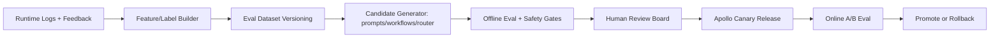

# ClearGlassInc Artemis — Self-Evolving AI Intelligence Platform  
### (Palantir Gotham + Foundry + AIP + Apollo)

## System Architecture

### 1) End-to-End Full-Stack Topology (Zero-Trust, Coalition-Aware, Low-Latency)

```mermaid
flowchart LR
  subgraph UI[Frontend Experience Layer]
    U1[Mission UI: Next.js + TypeScript]
    U2[Ops Map: deck.gl / Cesium]
    U3[Analyst Copilot Panel]
    U4[Approval + Explainability Console]
  end

  subgraph EDGE[Access Edge]
    E1[Envoy API Gateway]
    E2[OIDC/SAML + mTLS]
    E3[Policy Enforcement Point]
    E4[WebSocket + gRPC-Web]
  end

  subgraph SVC[Backend Control Plane - Python]
    S1[Ingestion Service]
    S2[Fusion Service]
    S3[Case Service]
    S4[Workflow Service]
    S5[Agent Orchestrator]
    S6[Eval Service]
    S7[Audit/Provenance Service]
  end

  subgraph EVT[Streaming Fabric]
    K1[Redpanda/Kafka]
    K2[Schema Registry]
    K3[DLQ + Replay]
    K4[CDC Connectors]
  end

  subgraph FDR[Foundry Data Plane]
    F1[Bronze/Silver/Gold Pipelines]
    F2[Ontology Objects, Links, Actions]
    F3[Lineage + Data Health]
    F4[Policy-Tagged Data Products]
  end

  subgraph AIP[AIP AI Plane]
    A1[Model Router]
    A2[Agent Runtime]
    A3[Prompt/Workflow Registry]
    A4[Evals + Red Team Harness]
  end

  subgraph OPS[Apollo Delivery Plane]
    O1[Ring/Canary Promotion]
    O2[Drift Detection]
    O3[Rollback + Freeze]
    O4[Signed Artifact Control]
  end

  UI --> EDGE --> SVC
  SVC <--> EVT
  SVC <--> FDR
  SVC <--> AIP
  AIP --> OPS
```



### 2) Palantir Platform Responsibility Split
- **Gotham**: live intelligence operations (cases, entities, timelines, investigations, watchlists).
- **Foundry**: data integration, ontology modeling, pipelines, lineage, policy-bound app logic.
- **AIP**: copilots, multi-agent orchestration, tools, evaluations, prompt/workflow experimentation.
- **Apollo**: secure deployment lifecycle, staged rollout, environment policy, runtime rollback.

### 3) Service Boundaries (Python-First)
- `ingestion-svc`: adapters for NVD, GDELT, ADS-B, internal SIEM, partner feeds.
- `fusion-svc`: entity resolution, confidence recalibration, temporal stitching.
- `case-svc`: mission case lifecycle + SLA + assignment.
- `agent-svc`: tool-using agents + approval gates.
- `eval-svc`: offline evals, online A/B, drift monitors.
- `policy-svc`: OPA integration, ABAC/ReBAC enforcement.
- `audit-svc`: immutable event chain + explainability trace.

---

## Data and Ontology

### 1) Ontology Core (Foundry Objects)

```yaml
objects:
  Mission:
    key: mission_id
    attrs: [name, objective, theater, priority, coalition_tags, constraints, status]

  Entity:
    key: entity_id
    attrs: [entity_type, canonical_name, aliases, risk_score, confidence, labels]

  Signal:
    key: signal_id
    attrs: [source, ingest_ts, event_ts, raw_hash, qos, confidence, payload_uri]

  Event:
    key: event_id
    attrs: [event_type, severity, confidence, location, first_seen, last_seen]

  Hypothesis:
    key: hypothesis_id
    attrs: [statement, probability, supporting_evidence, contradicting_evidence, state]

  Recommendation:
    key: rec_id
    attrs: [action_type, rationale, expected_impact, risk, confidence, requires_approval]

  OperatorFeedback:
    key: feedback_id
    attrs: [verdict, edits, rationale, trust_score, timestamp]

links:
  - OBSERVED_AS(Signal -> Event)
  - INDICATES(Event -> Hypothesis)
  - INVOLVES(Event -> Entity)
  - SUPPORTS(Recommendation -> Hypothesis)
  - SCOPED_TO(Recommendation -> Mission)
  - REVIEWED_BY(OperatorFeedback -> Recommendation)
  - DERIVED_FROM(* -> Signal)
```

### 2) Confidence, Lineage, and Temporal Semantics
Every object/edge includes:
- `confidence.score` + `confidence.method` (rule/model/human)
- `lineage.source_system`, `lineage.pipeline_version`, `lineage.model_version`
- `valid_time` and `transaction_time` for bi-temporal analysis
- classification tags: `classification`, `compartment`, `coalition`, `need_to_know`

### 3) Permission-Aware Query Pattern

```sql
SELECT
  e.event_id,
  e.event_type,
  e.severity,
  e.confidence,
  e.location,
  m.mission_id
FROM ontology.events e
JOIN ontology.event_mission em ON em.event_id = e.event_id
JOIN ontology.missions m ON m.mission_id = em.mission_id
WHERE m.mission_id = ANY(:mission_scope)
  AND e.classification <= :clearance_level
  AND e.coalition = ANY(:allowed_coalitions)
  AND e.compartment && :allowed_compartments;
```

### 4) Foundry Pipeline Layers
- **Bronze**: raw source fidelity and schema capture.
- **Silver**: normalized schema, dedupe, basic validation.
- **Gold**: ontology-ready products (entity/event/hypothesis/recommendation).
- **Mission views**: need-to-know scoped data products per operation.

---

## AI and Agent Design

### 1) Copilot Profiles
- **Analyst Copilot**: timeline synthesis, entity context, case drafting.
- **Commander Copilot**: COA comparison, risk tradeoffs, “why now” briefs.
- **Steward Copilot**: data quality, ontology drift, policy anomaly explanations.

### 2) Agent Mesh (AIP)
- `triage_agent`: priority + dedupe + mission relevance.
- `enrichment_agent`: graph expansion + cross-source enrichment.
- `correlation_agent`: motif detection + anomaly scoring.
- `briefing_agent`: explainable narrative with citation graph.
- `recommendation_agent`: action options with confidence/risk.
- `compliance_agent`: hard policy gate + redaction/gating.

### 3) Tool Contract (Strict and Auditable)

```python
from typing import Any, Literal
from pydantic import BaseModel, Field

class ToolCall(BaseModel):
    tool: Literal[
        "query_ontology", "query_timeseries", "open_case", "update_case",
        "generate_brief", "recommend_action", "request_approval", "publish_product"
    ]
    mission_id: str
    case_id: str | None = None
    payload: dict[str, Any] = Field(default_factory=dict)
    justification: str
    sensitivity: Literal["low", "medium", "high"]

class ToolResult(BaseModel):
    allowed: bool
    decision: Literal["allow", "deny", "allow_with_redaction", "require_approval"]
    output: dict[str, Any] = Field(default_factory=dict)
    policy_trace_id: str
    audit_id: str
```

---

## Self-Improvement Loop

### 1) Learning Signals Captured
- operator accepts/rejects/edits recommendations
- final mission outcomes (success, delay, false alarm, cost)
- query reformulations and abandoned investigative paths
- latency and trust ratings per mission and analyst role

### 2) Improvement Pipeline (Guardrailed)



### 3) Hard Safety Controls
- No autonomous policy changes.
- No autonomous objective rewrites.
- Any operational action above severity threshold requires human approval.
- Candidate prompt/workflow/model routing changes require:
  1. offline pass,
  2. board approval,
  3. canary pass,
  4. immutable audit record.

### 4) Drift & Rollback Criteria
- precision drop > 3% over 24h window
- policy violation count > 0
- latency p95 breach > SLO for 3 consecutive windows
- operator trust score drop > threshold

---

## Full-Stack Implementation

### 1) Web Application Blueprint
- **Framework**: Next.js + TypeScript + TanStack Query + Zustand.
- **Realtime**: WebSocket mission streams + gRPC-web fallback.
- **Geospatial**: deck.gl layers for event density, route vectors, risk heatmaps.
- **UX Contracts**:
  - action cards always show confidence + provenance + policy status
  - approvals are explicit and dual-confirm for high-risk actions

### 2) API Gateway and BFF
- Envoy at edge for mTLS, JWT validation, request signing.
- Python BFF (`fastapi`) shapes coalition-safe payloads.
- Request context includes: mission scope, clearance, coalition, compartment tags.

### 3) Backend Runtime (Python)
- `FastAPI + Pydantic v2 + SQLAlchemy + asyncpg`
- `Temporal` workflows for long-running case orchestration.
- `Redpanda/Kafka` for ingestion/events.
- `PostgreSQL + TimescaleDB + PostGIS` for transactional/time-series/geo.
- `Qdrant` (local) for RAG retrieval (classified embeddings on-prem).

### 4) AI Runtime
- model-router service chooses local model endpoints by:
  - classification ceiling
  - latency budget
  - mission criticality
  - historical eval performance
- supports shadow mode routing for safe experimentation.

### 5) Observability and Evals
- OpenTelemetry traces across UI/API/agents/tools/workflows.
- Prometheus + Grafana mission dashboards.
- Eval board: precision, recall, FPR, time-to-triage, operator overrides, trust delta.

---

## Security and Governance

### 1) Need-to-Know Enforcement
- ABAC (attributes), ReBAC (relationship), mission scope constraints.
- Row/column/entity/action-level enforcement at query and tool layers.
- Default deny unless policy explicitly allows.

### 2) Coalition and Compartment Controls
- Separate compartments (`NATO-X`, `Partner-Y`, etc.) with cross-domain guards.
- Attribute filtering + redaction for mixed coalitions.
- Policy trace returned on every denied/redacted action.

### 3) Provenance and Immutable Logs
- append-only audit store (hash-chained records)
- each AI output links to: prompt version, workflow version, model route, source entities, policy decision
- forensic replay supported via event log + workflow snapshot

### 4) Governance as Code
- policy repos with mandatory reviews, signed commits, CI checks
- model registry with promotion gates and deprecation controls
- prompt/workflow registry treated as versioned production artifacts

---

## Code Examples

### 1) Python FastAPI Backend: Action Endpoint + Policy Gate

```python
from fastapi import FastAPI, Depends, HTTPException
from pydantic import BaseModel, Field
from services.policy import evaluate_action
from services.audit import append_audit
from services.approval import create_approval_task
from services.executor import execute_action

app = FastAPI()

class ActionRequest(BaseModel):
    mission_id: str
    case_id: str
    action_type: str
    payload: dict = Field(default_factory=dict)
    rationale: str

@app.post("/v1/actions")
async def submit_action(req: ActionRequest, principal=Depends(...)):
    decision = await evaluate_action(principal=principal, request=req)

    await append_audit(
        event_type="action_requested",
        principal=principal.subject,
        mission_id=req.mission_id,
        payload=req.model_dump(),
        policy=decision.model_dump(),
    )

    if decision.decision == "deny":
        raise HTTPException(status_code=403, detail=decision.reason)

    if decision.decision in {"require_approval", "allow_with_redaction"}:
        approval_id = await create_approval_task(req, principal, decision)
        return {"status": "pending_approval", "approval_id": approval_id}

    result = await execute_action(req, principal)
    await append_audit(event_type="action_executed", principal=principal.subject, payload=result)
    return {"status": "executed", "result": result}
```

### 2) Streaming Event Handler: GDELT/NVD/ADS-B Fusion

```python
import asyncio
from services.resolve import resolve_entities
from services.scoring import compute_threat_score
from services.store import upsert_event, emit_topic

async def process_signal(signal: dict) -> None:
    entities = await resolve_entities(signal)
    threat = compute_threat_score(signal, entities)

    event = {
        "event_id": signal["signal_id"],
        "event_type": signal["kind"],
        "severity": threat["severity"],
        "confidence": threat["confidence"],
        "entities": entities,
        "source": signal["source"],
        "event_ts": signal["event_ts"],
    }

    await upsert_event(event)
    await emit_topic("alerts.triaged", event)

async def main(consumer):
    async for msg in consumer:
        await process_signal(msg.value)

if __name__ == "__main__":
    asyncio.run(main(...))
```

### 3) Ontology-Driven Query Service

```python
from sqlalchemy import text

QUERY = text("""
SELECT e.event_id, e.event_type, e.severity, e.confidence, e.event_ts
FROM ontology.events e
WHERE e.mission_id = ANY(:mission_ids)
  AND e.classification <= :clearance
  AND e.coalition = ANY(:coalitions)
ORDER BY e.event_ts DESC
LIMIT :limit
""")

async def get_recent_events(db, mission_ids, clearance, coalitions, limit=100):
    rows = await db.fetch_all(
        QUERY,
        {
            "mission_ids": mission_ids,
            "clearance": clearance,
            "coalitions": coalitions,
            "limit": limit,
        },
    )
    return [dict(r) for r in rows]
```

### 4) Agent Workflow State Machine (Temporal style)

```python
from enum import Enum

class Stage(str, Enum):
    TRIAGE = "triage"
    ENRICH = "enrich"
    CORRELATE = "correlate"
    BRIEF = "brief"
    RECOMMEND = "recommend"
    APPROVAL = "approval"
    EXECUTE = "execute"
    CLOSED = "closed"

ALLOWED = {
    Stage.TRIAGE: {Stage.ENRICH},
    Stage.ENRICH: {Stage.CORRELATE},
    Stage.CORRELATE: {Stage.BRIEF},
    Stage.BRIEF: {Stage.RECOMMEND},
    Stage.RECOMMEND: {Stage.APPROVAL},
    Stage.APPROVAL: {Stage.EXECUTE, Stage.CLOSED},
    Stage.EXECUTE: {Stage.CLOSED},
}

def transition(current: Stage, nxt: Stage) -> Stage:
    if nxt not in ALLOWED[current]:
        raise ValueError(f"invalid transition: {current} -> {nxt}")
    return nxt
```

### 5) Eval Pipeline + A/B Decision Logic

```python
from dataclasses import dataclass

@dataclass
class Gates:
    precision_min: float = 0.90
    recall_min: float = 0.82
    fpr_max: float = 0.08
    latency_p95_ms_max: int = 2500
    policy_violations_max: int = 0


def pass_gates(metrics: dict, g: Gates) -> bool:
    return (
        metrics["precision"] >= g.precision_min
        and metrics["recall"] >= g.recall_min
        and metrics["fpr"] <= g.fpr_max
        and metrics["latency_p95_ms"] <= g.latency_p95_ms_max
        and metrics["policy_violations"] <= g.policy_violations_max
    )


def choose_variant(control: dict, candidate: dict) -> str:
    # weighted objective favors precision and trust, penalizes latency and violations
    def score(m):
        return (2.5*m["precision"] + 1.5*m["recall"] + 2.0*m["trust"]
                - 0.001*m["latency_p95_ms"] - 10.0*m["policy_violations"])
    return "candidate" if score(candidate) > score(control) else "control"
```

### 6) Prompt/Workflow Version Proposal with Human Approval

```python
class UpgradeProposal(BaseModel):
    proposal_id: str
    target: Literal["prompt", "workflow", "router"]
    current_version: str
    candidate_version: str
    evidence_metrics: dict
    risk_assessment: dict
    reviewer_ids: list[str]
    status: Literal["draft", "pending_review", "approved", "rejected", "rolled_back"]

async def submit_upgrade(proposal: UpgradeProposal):
    # cannot auto-approve by policy
    proposal.status = "pending_review"
    await save_proposal(proposal)
    await notify_review_board(proposal)
```

---

## Scenario Walkthrough (Cinematic + Technically Credible)

1. **Ingress (T+00s):** A live ADS-B anomaly and GDELT geopolitical spike enter `signals.raw`.
2. **Fusion (T+02s):** `fusion-svc` correlates both with an existing Entity cluster tied to a sanctioned logistics network; confidence rises 0.58 → 0.86.
3. **Triage (T+04s):** `triage_agent` marks event high priority due to mission overlap and threat motif match.
4. **Recommendation (T+07s):** `recommendation_agent` proposes three actions: open priority case, task additional ISR, notify commander.
5. **Policy Gate (T+08s):** `compliance_agent` flags commander notification as `require_approval` due to coalition compartment policy.
6. **Operator Interaction (T+20s):** Commander approves two actions, edits notification timing, rejects one optional escalation.
7. **Execution + Audit (T+22s):** approved actions execute; all transitions, prompts, model routes, and policy traces are immutable in audit chain.
8. **Outcome (T+3h):** ground truth confirms event as true positive; operator edit prevented premature disclosure.
9. **Self-Improvement (Daily cycle):** eval builder labels this sequence as high-value correction; candidate workflow increases “delay-notify when corroboration missing.”
10. **Controlled Upgrade (Next release window):** candidate passes offline gates, review board approves, Apollo canary shows +4.2% precision and stable latency; promoted.

Result: **ClearGlassInc Artemis** continuously improves analytical quality, operator trust, and mission speed **without unsafe autonomous behavior changes**.
