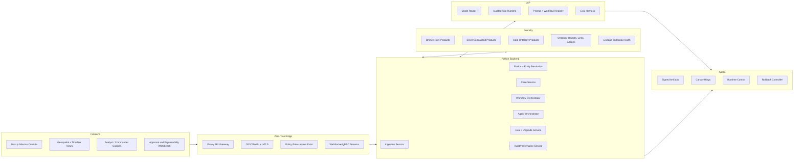
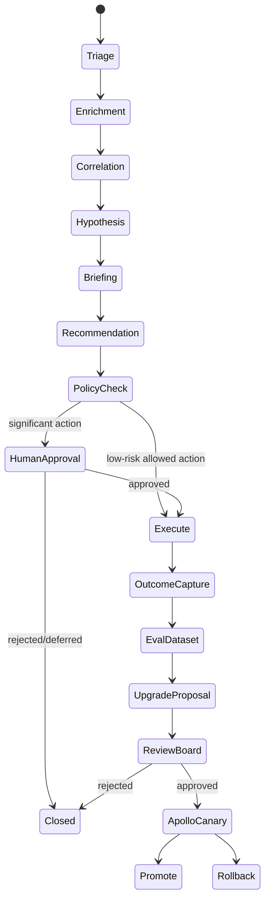
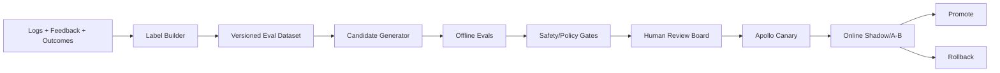

# ClearGlassInc Artemis — Self-Evolving AI Intelligence Platform

> **Executive intent.** ClearGlassInc Artemis is a secure, coalition-aware, multi-domain intelligence platform built on **Palantir Gotham**, **Foundry**, **AIP**, and **Apollo**. It fuses live and historical data, reasons over a governed ontology, supports mission-critical analyst and commander workflows, and safely improves its own prompts, workflows, model routing, heuristics, and evaluation suites through explicit human-approved guardrails.

---

## System Architecture

### Palantir Product Responsibilities

| Layer | Palantir capability | Artemis use |
|---|---|---|
| Operational intelligence | **Gotham** | Investigations, entity tracking, link analysis, operational timelines, watchlists, case work, and mission workflows. |
| Data and ontology | **Foundry** | Governed ingestion, transforms, data lineage, ontology objects, object actions, semantic permissions, and operational applications. |
| AI orchestration | **AIP** | Analyst and commander copilots, tool-using agents, prompt registries, workflow automation, model routing, online/offline evaluations. |
| Deployment control | **Apollo** | Signed releases, runtime configuration, canary deployment, rollback, environment targeting, disconnected-edge updates, and mission freeze windows. |

### End-to-End Topology



### Runtime Principles

1. **Ontology first:** humans and agents operate over the same Foundry ontology rather than ungoverned data dumps.
2. **Python for precision:** backend services, event handlers, policy checks, eval pipelines, and agent tools use typed Python contracts and deterministic workflow state machines.
3. **Human authority:** AIP can recommend, draft, simulate, and prepare action packages; operationally significant actions require explicit human approval.
4. **Self-improvement as change management:** prompts, workflows, routing policies, and heuristics are versioned artifacts evaluated before Apollo canaries and rollback.
5. **Coalition-aware by construction:** policy filtering occurs before retrieval, before prompt construction, before tool execution, and before export.

---

## Data and Ontology

### Core Ontology Objects

```yaml
objects:
  Mission:
    key: mission_id
    properties: [name, objective, theater, priority, status, commander_intent, latency_budget_ms, coalition_tags, compartments]
  Actor:
    key: actor_id
    properties: [actor_type, canonical_name, aliases, affiliations, risk_score, confidence_score, classification]
  Asset:
    key: asset_id
    properties: [asset_type, owner, location, readiness_state, telemetry_state, permissions]
  Signal:
    key: signal_id
    properties: [source_system, event_ts, ingest_ts, payload_uri, raw_hash, source_reliability, schema_version]
  Event:
    key: event_id
    properties: [event_type, severity, state, location, first_seen, last_seen, confidence_score, mission_relevance]
  Case:
    key: case_id
    properties: [title, status, assigned_team, priority, opened_at, closed_at, classification]
  Hypothesis:
    key: hypothesis_id
    properties: [statement, probability, support_score, contradiction_score, generated_by, review_state]
  Recommendation:
    key: recommendation_id
    properties: [action_type, rationale, expected_impact, risk_score, confidence_score, approval_state]
  OperatorFeedback:
    key: feedback_id
    properties: [operator_id, verdict, edited_fields, rationale, trust_score, timestamp, outcome_link]
  UpgradeProposal:
    key: proposal_id
    properties: [target, current_version, candidate_version, eval_metrics, approval_state, apollo_ring]

links:
  OBSERVED_AS: Signal -> Event
  INVOLVES: Event -> Actor
  IMPACTS: Event -> Asset
  SCOPED_TO: Event -> Mission
  OPENED_FROM: Case -> Event
  INDICATES: Event -> Hypothesis
  SUPPORTS: Signal -> Hypothesis
  CONTRADICTS: Signal -> Hypothesis
  RECOMMENDS_FOR: Recommendation -> Mission
  JUSTIFIED_BY: Recommendation -> Hypothesis
  REVIEWED_BY: Recommendation -> OperatorFeedback
  PROPOSES_CHANGE: UpgradeProposal -> Recommendation
```

### Shared Metadata Envelope

Every object and relationship carries confidence, lineage, temporal state, mission context, and permissions.

```json
{
  "confidence": {"score": 0.86, "method": "model+human", "calibration_version": "confcal-2026.07.06"},
  "lineage": {"source_system": "partner-feed-alpha", "pipeline_version": "foundry-silver-42", "prompt_version": "triage-prompt-v31", "workflow_version": "mission-triage-v12", "model_route": "router-prod-18"},
  "temporal": {"valid_time_start": "2026-07-06T10:04:12Z", "valid_time_end": null, "transaction_time": "2026-07-06T10:04:18Z"},
  "security": {"classification": "SECRET", "compartments": ["ARTEMIS-ALPHA"], "coalitions": ["US", "CAN", "UK"], "need_to_know": ["mission:ART-2026-071"]}
}
```

### How the Ontology Drives Workflows and Agents

- Gotham case views render ontology objects, links, provenance, and timelines.
- Foundry object actions define safe verbs such as `open_case`, `attach_evidence`, `request_approval`, and `publish_brief`.
- AIP tools receive only mission-scoped ontology projections filtered by classification, compartment, coalition, and relationship permissions.
- Agents cite ontology object IDs and lineage in every answer so operators can inspect evidence, contradictions, and data quality.
- Feedback and outcomes become first-class ontology objects used by eval builders and upgrade proposals.

---

## AI and Agent Design

### Copilots

| Copilot | Primary users | Capabilities | Approval boundary |
|---|---|---|---|
| Analyst Copilot | Analysts | Evidence summaries, entity expansion, timeline generation, contradiction discovery, case-note drafting. | Cannot publish or escalate severity without review. |
| Commander Copilot | Commanders | Decision briefs, risk comparisons, recommended courses of action, impact summaries. | Cannot execute operational actions. |
| Steward Copilot | Data/policy stewards | Lineage explanation, data-quality diagnosis, policy-denial explanation, ontology drift review. | Cannot weaken policy. |
| Engineering Copilot | Platform operators | Eval analysis, prompt diff summaries, rollback reports, model-route diagnostics. | Cannot deploy upgrades without approval. |

### Multi-Agent Workflow



Agents are specialized: `triage_agent`, `enrichment_agent`, `correlation_agent`, `hypothesis_agent`, `briefing_agent`, `recommendation_agent`, `compliance_agent`, and `upgrade_agent`. The `compliance_agent` is not advisory; it enforces hard policy and routes approval tasks.

---

## Self-Improvement Loop

### Captured Learning Signals

Artemis captures operator accepts/rejects/edits, query reformulations, abandoned paths, alert outcomes, false positives, false negatives, mission results, latency, retrieval quality, policy denials, model cost, commander edits, and post-mission after-action findings.

### Safe Upgrade Pipeline



Candidate changes may include prompt updates, workflow state transitions, retrieval filters, model-router thresholds, confidence calibration, alert scoring heuristics, and tool ordering. Artemis never autonomously changes access policy, mission objectives, approval authority, classification labels, or physical/operational action rules.

### Metrics

- **Precision/recall:** alert quality and missed-event control.
- **Latency:** p50/p95/p99 response and workflow duration.
- **Operator trust:** accept rate, edit distance, rejection rationale, survey score.
- **Mission impact:** confirmed true positives, decision time saved, avoided duplicate work.
- **Safety:** policy violations, redaction misses, unsupported claims, hallucination rate.
- **Deployment health:** rollback rate, canary regressions, environment-specific failure rate.

---

## Full-Stack Implementation

### Frontend

- Next.js + TypeScript mission console.
- TanStack Query for server-state synchronization.
- WebSocket/gRPC stream for live events and agent progress.
- Map/timeline/entity graph views for Gotham-style analysis.
- Approval cards showing rationale, evidence, confidence, dissenting signals, policy trace, and rollback plan.

### Backend and Platform Services

- FastAPI BFF and microservices in typed Python.
- Temporal workflow workers for long-running mission workflows.
- Kafka/Redpanda event bus with schema registry, DLQ, replay, and idempotency keys.
- PostgreSQL/PostGIS/TimescaleDB for low-latency operational state.
- Foundry for governed lakehouse, transforms, ontology, object actions, lineage, and data health.
- Vector retrieval restricted to permitted documents and ontology-linked evidence.
- AIP model router and audited tool runtime.
- Apollo for signed releases, canaries, rollback, disconnected-edge promotion, and runtime configuration.

### API Surface

```http
POST /v1/events/ingest
GET  /v1/missions/{mission_id}/events
POST /v1/cases
POST /v1/agent-runs
POST /v1/actions
POST /v1/approvals/{approval_id}/decision
POST /v1/feedback
POST /v1/evals/run
POST /v1/upgrades/propose
POST /v1/upgrades/{proposal_id}/approve
```

---

## Security and Governance

- **Need-to-know:** ABAC + ReBAC + mission-scope policy across rows, columns, entities, relationships, and actions.
- **Coalition boundaries:** cross-coalition views use redaction, source substitution, and cross-domain approval workflows.
- **Zero trust:** mTLS service identity, signed requests, workload attestation, short-lived credentials, network segmentation.
- **Immutable provenance:** hash-chained audit logs record prompts, tools, model routes, source objects, policy decisions, reviewers, and deployment versions.
- **Policy as code:** OPA/Rego policies in signed repositories with tests and Apollo promotion gates.
- **Model governance:** model cards, route cards, eval evidence, risk tiers, allowed data domains, and rollback requirements.
- **Prompt governance:** prompt diffs, owners, eval coverage, approval history, and active mission freeze windows.

---

## Code Examples

### Python Domain Contracts

```python
from __future__ import annotations
from enum import Enum
from typing import Any, Literal
from pydantic import BaseModel, Field

class Classification(str, Enum):
    unclassified = "UNCLASSIFIED"
    controlled = "CONTROLLED"
    secret = "SECRET"
    top_secret = "TOP_SECRET"

class Principal(BaseModel):
    subject: str
    role: Literal["analyst", "commander", "steward", "service"]
    clearance: Classification
    coalitions: set[str]
    compartments: set[str]
    mission_scope: set[str]

class MissionContext(BaseModel):
    mission_id: str
    classification: Classification
    required_compartments: set[str]
    coalitions: set[str]
    latency_budget_ms: int = 2500

class PolicyDecision(BaseModel):
    decision: Literal["allow", "deny", "allow_with_redaction", "require_approval"]
    reason: str
    trace_id: str
    redactions: list[str] = Field(default_factory=list)
```

### Policy Check

```python
from uuid import uuid4

def dominates(user: Classification, required: Classification) -> bool:
    order = [Classification.unclassified, Classification.controlled, Classification.secret, Classification.top_secret]
    return order.index(user) >= order.index(required)

def evaluate_need_to_know(principal: Principal, mission: MissionContext, action: str, significant: bool) -> PolicyDecision:
    if mission.mission_id not in principal.mission_scope:
        return PolicyDecision(decision="deny", reason="mission out of scope", trace_id=str(uuid4()))
    if not dominates(principal.clearance, mission.classification):
        return PolicyDecision(decision="deny", reason="insufficient clearance", trace_id=str(uuid4()))
    if not mission.required_compartments.issubset(principal.compartments):
        return PolicyDecision(decision="deny", reason="missing compartment", trace_id=str(uuid4()))
    if not mission.coalitions.intersection(principal.coalitions):
        return PolicyDecision(decision="deny", reason="coalition boundary", trace_id=str(uuid4()))
    if significant or action in {"publish_product", "notify_commander", "execute_response"}:
        return PolicyDecision(decision="require_approval", reason="human approval required", trace_id=str(uuid4()))
    return PolicyDecision(decision="allow", reason="policy satisfied", trace_id=str(uuid4()))
```

### FastAPI Action Endpoint

```python
from fastapi import Depends, FastAPI, HTTPException

app = FastAPI(title="ClearGlassInc Artemis API")

class ActionRequest(BaseModel):
    mission_id: str
    case_id: str | None = None
    action_type: str
    payload: dict[str, Any] = Field(default_factory=dict)
    rationale: str
    operationally_significant: bool = True

@app.post("/v1/actions")
async def submit_action(req: ActionRequest, principal: Principal = Depends(...)):
    mission = await load_mission_context(req.mission_id)
    decision = evaluate_need_to_know(principal, mission, req.action_type, req.operationally_significant)
    audit_id = await append_audit("action_requested", principal.subject, req.model_dump(), decision.model_dump())
    if decision.decision == "deny":
        raise HTTPException(status_code=403, detail={"reason": decision.reason, "audit_id": audit_id})
    if decision.decision in {"require_approval", "allow_with_redaction"}:
        approval_id = await create_approval_task(req, principal, decision)
        return {"status": "pending_approval", "approval_id": approval_id, "audit_id": audit_id}
    result = await execute_action(req, principal)
    await append_audit("action_executed", principal.subject, result, decision.model_dump())
    return {"status": "executed", "result": result, "audit_id": audit_id}
```

### Ontology-Secured Query

```python
from sqlalchemy import text

RECENT_EVENTS = text("""
SELECT e.event_id, e.event_type, e.severity, e.confidence_score, e.location, e.first_seen, e.lineage
FROM ontology.events e
JOIN ontology.event_mission em ON em.event_id = e.event_id
WHERE em.mission_id = ANY(:mission_ids)
  AND e.classification <= :clearance
  AND e.coalitions && :coalitions
  AND e.compartments <@ :compartments
ORDER BY e.first_seen DESC
LIMIT :limit
""")

async def get_recent_events(db, principal: Principal, limit: int = 100) -> list[dict[str, Any]]:
    rows = await db.fetch_all(RECENT_EVENTS, {
        "mission_ids": list(principal.mission_scope),
        "clearance": principal.clearance.value,
        "coalitions": list(principal.coalitions),
        "compartments": list(principal.compartments),
        "limit": limit,
    })
    return [dict(row) for row in rows]
```

### Agent Tool Runtime

```python
class ToolCall(BaseModel):
    tool: Literal["query_ontology", "open_case", "attach_evidence", "generate_brief", "recommend_action", "request_approval"]
    mission_id: str
    case_id: str | None = None
    payload: dict[str, Any] = Field(default_factory=dict)
    justification: str
    sensitivity: Literal["low", "medium", "high"]

async def run_tool(call: ToolCall, principal: Principal) -> dict[str, Any]:
    mission = await load_mission_context(call.mission_id)
    significant = call.tool in {"recommend_action", "request_approval"}
    decision = evaluate_need_to_know(principal, mission, call.tool, significant)
    await append_audit("tool_call_attempted", principal.subject, call.model_dump(), decision.model_dump())
    if decision.decision == "deny":
        return {"allowed": False, "decision": decision.model_dump(), "output": None}
    output = await TOOL_REGISTRY[call.tool](call, principal, decision)
    await append_audit("tool_call_completed", principal.subject, output, decision.model_dump())
    return {"allowed": True, "decision": decision.model_dump(), "output": output}
```

### Workflow State Machine

```python
class Stage(str, Enum):
    triage = "triage"
    enrich = "enrich"
    correlate = "correlate"
    hypothesize = "hypothesize"
    brief = "brief"
    recommend = "recommend"
    policy_check = "policy_check"
    approval = "approval"
    execute = "execute"
    outcome = "outcome"
    closed = "closed"

ALLOWED_TRANSITIONS: dict[Stage, set[Stage]] = {
    Stage.triage: {Stage.enrich},
    Stage.enrich: {Stage.correlate},
    Stage.correlate: {Stage.hypothesize},
    Stage.hypothesize: {Stage.brief},
    Stage.brief: {Stage.recommend},
    Stage.recommend: {Stage.policy_check},
    Stage.policy_check: {Stage.approval, Stage.execute},
    Stage.approval: {Stage.execute, Stage.closed},
    Stage.execute: {Stage.outcome},
    Stage.outcome: {Stage.closed},
}

def transition(current: Stage, target: Stage) -> Stage:
    if target not in ALLOWED_TRANSITIONS[current]:
        raise ValueError(f"invalid workflow transition: {current} -> {target}")
    return target
```

### Eval and Upgrade Gates

```python
from dataclasses import dataclass

@dataclass(frozen=True)
class EvalGates:
    precision_min: float = 0.90
    recall_min: float = 0.82
    hallucination_rate_max: float = 0.02
    latency_p95_ms_max: int = 2500
    policy_violations_max: int = 0
    operator_trust_min: float = 0.78

def passes_eval_gates(metrics: dict[str, float], gates: EvalGates = EvalGates()) -> bool:
    return (
        metrics["precision"] >= gates.precision_min
        and metrics["recall"] >= gates.recall_min
        and metrics["hallucination_rate"] <= gates.hallucination_rate_max
        and metrics["latency_p95_ms"] <= gates.latency_p95_ms_max
        and metrics["policy_violations"] <= gates.policy_violations_max
        and metrics["operator_trust"] >= gates.operator_trust_min
    )

class UpgradeProposal(BaseModel):
    proposal_id: str
    target: Literal["prompt", "workflow", "model_router", "retrieval_policy", "confidence_calibration"]
    current_version: str
    candidate_version: str
    evidence_metrics: dict[str, float]
    affected_missions: list[str]
    risk_assessment: dict[str, Any]
    reviewer_ids: list[str]
    status: Literal["draft", "pending_review", "approved", "rejected", "canary", "promoted", "rolled_back"]

async def submit_upgrade_proposal(proposal: UpgradeProposal) -> UpgradeProposal:
    if not passes_eval_gates(proposal.evidence_metrics):
        proposal.status = "rejected"
        await append_audit("upgrade_rejected_by_eval_gate", "eval-service", proposal.model_dump(), {})
        return proposal
    proposal.status = "pending_review"
    await save_upgrade_proposal(proposal)
    await notify_review_board(proposal)
    await append_audit("upgrade_pending_human_review", "eval-service", proposal.model_dump(), {})
    return proposal
```

### TypeScript Approval Card Sketch

```tsx
export function ApprovalCard({ recommendation, onApprove, onReject }: Props) {
  return (
    <section className="rounded-2xl border border-cyan-400/30 bg-slate-950/80 p-5">
      <h2>{recommendation.actionType}</h2>
      <p>{recommendation.rationale}</p>
      <dl>
        <dt>Confidence</dt><dd>{Math.round(recommendation.confidence * 100)}%</dd>
        <dt>Policy trace</dt><dd>{recommendation.policyTraceId}</dd>
        <dt>Prompt</dt><dd>{recommendation.promptVersion}</dd>
      </dl>
      <EvidenceList evidence={recommendation.evidence} />
      <button onClick={() => onApprove(recommendation.id)}>Approve</button>
      <button onClick={() => onReject(recommendation.id)}>Reject</button>
    </section>
  );
}
```

---

## Scenario Walkthrough

### 1. Live Event Ingress

At 03:14:22Z, a partner feed, facility telemetry stream, and open-source alert produce a correlated anomaly. The ingestion service validates schemas, writes raw payloads to Foundry bronze, emits `SignalObserved` events, and records raw hashes for provenance.

### 2. Triage and Fusion

The fusion service resolves the observed actor, facility asset, and mission context. Foundry silver normalizes the payload; Foundry gold materializes ontology objects and links. The `triage_agent` sees only the permitted projection and marks the event as high relevance with supporting and contradicting evidence.

### 3. Recommendation

The `correlation_agent` identifies two historical analogs. The `hypothesis_agent` drafts competing hypotheses. The `briefing_agent` generates a cited timeline. The `recommendation_agent` proposes opening a priority Gotham case, notifying the commander, and requesting additional collection.

### 4. Approval Gate

The compliance agent allows case creation but requires approval for commander notification because it is operationally significant. The approval workbench shows source evidence, confidence, lineage, model route, prompt version, policy trace, and dissenting evidence.

### 5. Operator Decision

The operator approves the case, edits the notification language, and rejects one proposed collection task as redundant. Artemis records the edits as structured feedback: accepted case action, edited risk language, rejected collection action, and rejection rationale.

### 6. Outcome Capture

Six hours later, the case is confirmed as a true positive. The edited commander-language template performs better in operator review than the original. The rejected collection task is labeled as waste avoided.

### 7. Self-Improvement

The eval builder turns the incident into a versioned eval case. The candidate generator proposes a prompt update that softens unsupported risk language and a workflow update that checks for redundant collection before recommendation. Offline evals improve precision and operator trust without increasing latency or policy violations. A human review board approves a limited Apollo canary. Online shadow evaluation confirms improvement, and Apollo promotes the new prompt/workflow bundle. If precision, latency, or policy safety had regressed, Apollo would roll back automatically and preserve the failed candidate for review.
